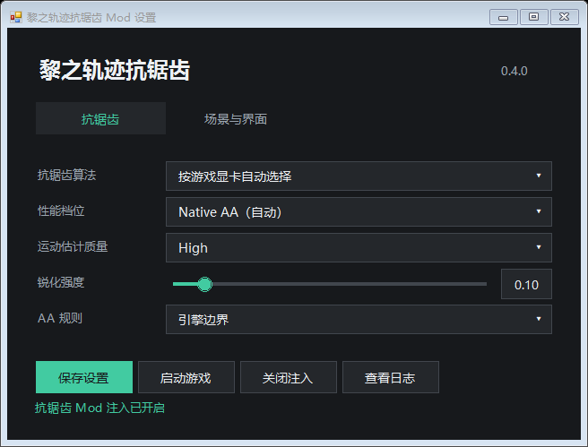

# Kuro AA Mod

为 PC 云豹版《英雄传说：黎之轨迹》提供 NVIDIA DLAA、AMD FSR Native AA 和 Intel XeSS Native AA，减轻头发、栏杆和远处细线的闪烁。复制文件即可使用，无需另行安装 ReShade。

0.4.1 只使用这三家的原生分辨率抗锯齿技术，保持游戏渲染尺寸。升采样的稳定接入受技术限制，暂未实现可发布版本。相关实验保存在 `codex/scene-scale-experiments` 分支，不随正式包分发。

## 游戏支持

界面保护规则适配云豹 1.1.0 版《黎之轨迹 I》，其它发行商版本不在当前支持范围内。

《黎之轨迹 II》云豹版尚未适配界面保护规则。可以手动尝试全屏 AA，但兼容性没有验证，文字也可能模糊或残影。安装脚本和设置器的游戏启动功能目前面向一代；二代请从 Steam 启动。

## 安装与升级

从 [Releases](https://github.com/Jeoitim/kuro-aa-mod/releases/latest) 下载 `KuroAA-0.4.1-portable.zip`，不要下载自动生成的源码 ZIP。

1. 退出游戏和设置器。升级前备份设置，卸载旧版本。
2. 将包内 `GameFiles` 的内容复制到含游戏程序的目录。一代程序为 `ed9.exe`。
3. 启动游戏，或打开 `KuroAA/KuroAA.Settings.exe` 调整设置。

遇到已有的 `dxgi.dll`、`d3d11.dll` 或 ReShade 配置时不要直接覆盖，先处理其它注入器的冲突。本包新增 `dxgi.dll`、`ReShade.ini` 和 `KuroAA` 文件夹，运行库与许可证都在 `KuroAA` 内。

## 设置

退出游戏后保存设置，下次启动生效。设置器只管理本 Mod。



| 设置 | 建议 |
| --- | --- |
| NVIDIA 显卡 | NVIDIA DLAA |
| AMD 显卡 | AMD FSR Native AA |
| Intel 显卡 | Intel XeSS Native AA |
| 游戏内抗锯齿 | 先关闭，避免叠加后画面过软 |
| 运动估计质量 | 默认高；帧率压力明显时可试标准 |
| 锐化强度 | 默认 0，需要时先试 0.03–0.08 |
| 角色界面抗锯齿（实验） | 默认关闭，开启可能卡顿 |
| 诊断采集 | 正常游玩保持关闭 |

原生抗锯齿模式固定为 DLAA 或 Native AA。标准／高只调整运动估计质量，不改变渲染分辨率。锐化可填 0.00–1.00，步长 0.01；过高容易出现亮边，不能靠它消除残影。

通常保持屏幕原生分辨率即可。Mod 按实际场景纹理尺寸处理，不限于 1080p；1440p、4K 会增加处理和显存开销，尚未完成所有游戏场景的验收。详见 [分辨率说明](docs/user/resolution.md)。

### 场景与界面

三种 AA 规则一次选择一种，切换规则不会更换厂商算法。

| 规则 | 处理范围 |
| --- | --- |
| 引擎边界 | 默认选项，在界面绘制前处理场景；无法确认边界时跳过 |
| Shader 签名 | 在识别到界面着色器前处理场景；部分界面可能无法识别 |
| 全屏 AA | 处理最终画面，覆盖场景和界面；文字可能模糊、变形或残影 |

全屏 AA 仍是抗锯齿。关闭效果请在算法列表中选择“关闭”。详见 [规则说明](docs/user/aa-rules.md)。

装备、换装页的独立角色模型默认不单独处理。勾选“角色界面抗锯齿（实验）”后，模型使用独立的原生 AA，文字保持隔离。进入面板或切换角色仍可能明显停顿，建议先保持关闭。全屏 AA 不再叠加这项处理。

0.4.1 包含角色缓存预算、数量上限、可用显存保护，以及着色器编译缓存和启动预热。它们减少部分重复准备工作，不能保证完全无卡顿。详见 [角色说明](docs/user/vendor-preview.md) 和 [缓存设置](docs/user/cache-settings.md)。

## 画质与性能

运动信息由 AeonSR 光流估算，没有使用游戏原生运动矢量，因此效果不等同游戏原生集成。快速转动镜头、移动物体和透明特效仍可能残影，画面也可能偏软。采样抖动保持关闭，避免已观察到的镜头抖动。

本 Mod 会增加 GPU 和显存开销，不以提升帧率为目标，也不提供帧生成。完整战斗布局、HDR、MSAA 与输入延迟尚未全部验收。RTX 3060 Laptop、1080p 只是作者的测试环境，不是推荐设备或最低配置。

## 关闭与卸载

退出游戏后，可用设置器关闭效果，或用“关闭注入”停止加载整个 Mod。

手动安装时，对照便携包删除本包新增的 `dxgi.dll`、`ReShade.ini` 和 `KuroAA`。关闭注入后的文件名为 `dxgi.dll.kuro-disabled`。不要删除游戏、存档、其它 Mod 或自己的回滚备份。

脚本安装会记录新增文件，可按记录卸载：

```powershell
./tools/Install.ps1 -GameDirectory "<游戏目录>" -PackageDirectory "<解压目录>/GameFiles"
./tools/Uninstall.ps1 -GameDirectory "<游戏目录>"
```

脚本保留存档、日志和未知文件；改动过的二进制不会直接删除。

## 参与适配与优化

欢迎贡献者参与《黎之轨迹 II》云豹版适配，或改进现有原生 AA 的界面保护、角色处理和加载开销。函数边界定位、shader 哈希与资源流记录、可复现的问题报告也能帮助适配。

开始前请读 [文档导航](docs/README.md)、[二代适配清单](docs/adaptation/kuro2-checklist.md) 和 [贡献指南](CONTRIBUTING.md)。完成验证后欢迎提交 PR，并写明游戏版本、复现步骤、验证结果和仍有的问题。

## 开发与许可

开发说明见 [构建](docs/development/building.md)、[架构](docs/development/architecture.md)、[验证记录](docs/validation/native-aa.md) 与 [调试](docs/development/debugging.md)。后续计划适配二代的界面保护，并继续优化角色处理的初始化开销，尚无确定发布日期。

原创代码采用 MIT。第三方组件遵循随附许可，请保留 `Licenses`。本包基于 [AeonSR v1.0.1](https://github.com/BarbatosAWLS/AeonSR/releases/tag/v1.0.1) 与 [ReShade 6.8.0](https://reshade.me/)，包含原生 AA 限定和独立角色视图扩展。
